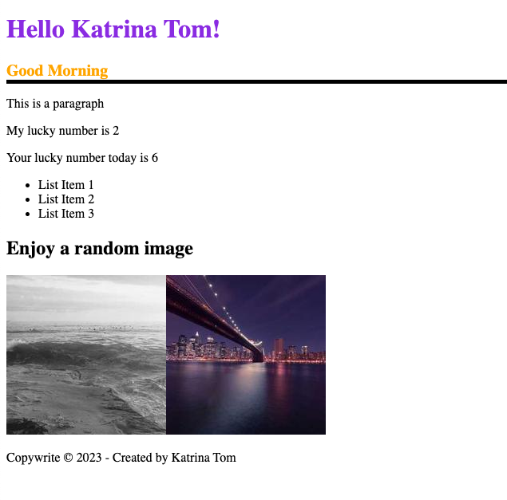

# practice_react
Created with CodeSandbox

https://codesandbox.io/s/introduction-to-jsx-forked-6y8df7?file=/package.json:0-520

## Learning

* JSX 
* Expression vs Statement in JS: 

https://www.youtube.com/watch?v=WVyCrI1cHi8&list=PL-xu4i_QDSxcoDNeh8rx5-pHCCTOg0XsI

* Template Literals ES6
* Generate styling 

https://picsum.photos/

* Inline Styling 

## Screenshots

